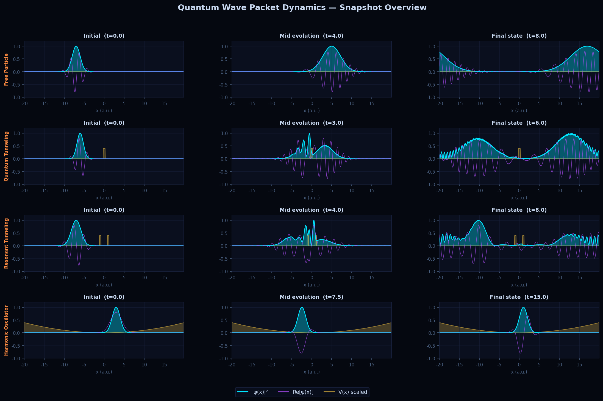
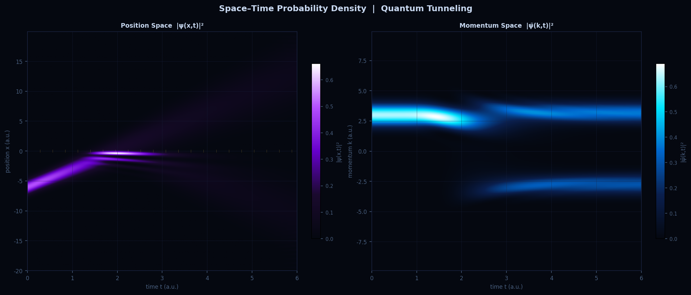
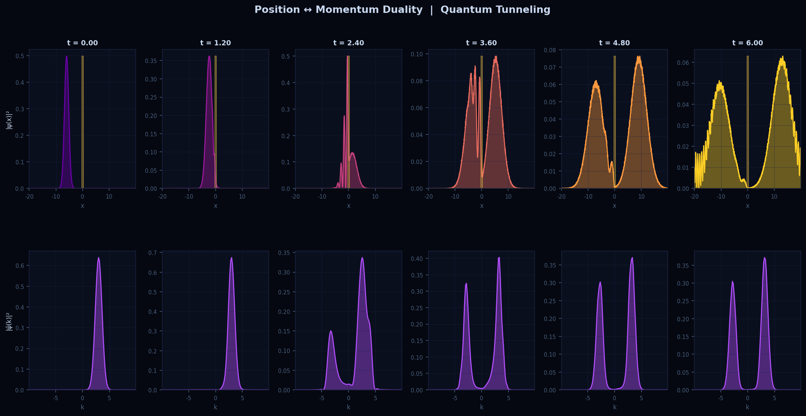
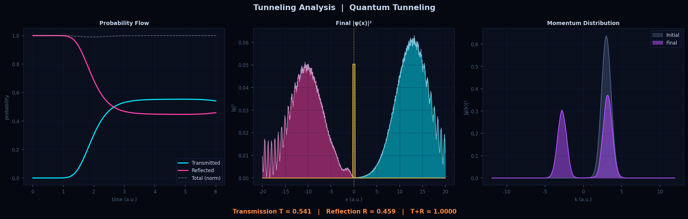
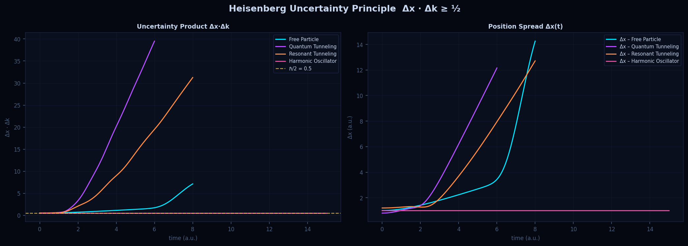
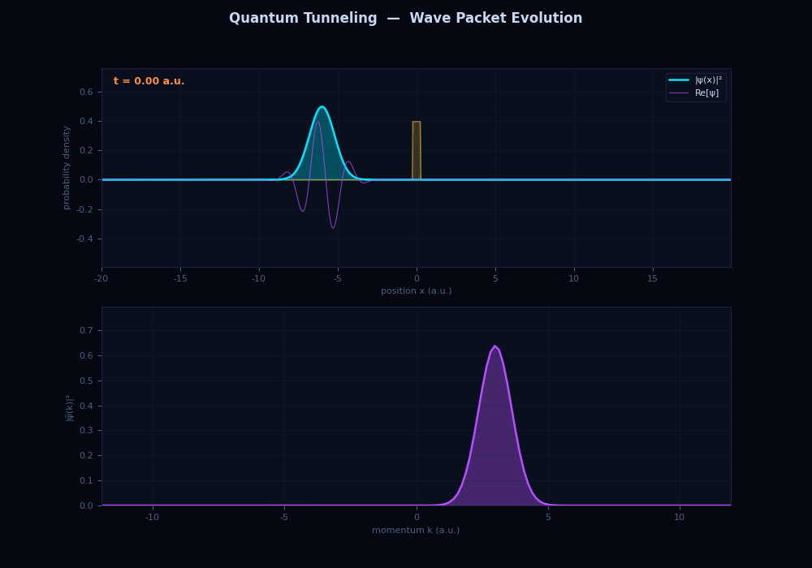

# Quantum Wave Packet Dynamics

Numerical simulation of 1D quantum wave packet evolution using the **Split-Step Fourier Method (SSFM)**. Explores four physical scenarios — free propagation, quantum tunneling, resonant tunneling, and harmonic confinement — with full position/momentum space analysis.

> This project connects my background in Digital Signal Processing (Fourier analysis, spectral methods) with quantum mechanics, where the same mathematical machinery governs the duality between position and momentum representations.

---

## Physics

The time-dependent Schrödinger equation for a particle in potential V(x):

$$i\hbar \frac{\partial \psi}{\partial t} = \left[ -\frac{\hbar^2}{2m}\frac{\partial^2}{\partial x^2} + V(x) \right] \psi$$

is solved numerically using **Strang splitting** (2nd-order accurate):

$$U(\Delta t) \approx e^{-iV\Delta t/2\hbar} \cdot \mathcal{F}^{-1}\left[ e^{-iK\Delta t/\hbar} \cdot \mathcal{F}\left[ e^{-iV\Delta t/2\hbar} \psi \right] \right]$$

where K = ℏk²/2m is the kinetic energy operator, diagonal in momentum space. The FFT makes each step O(N log N).

Atomic units are used throughout: ℏ = m = 1.

---

## Scenarios

| Scenario | Physical content | Key observable |
|---|---|---|
| **Free particle** | Dispersion of a Gaussian wave packet | Δx grows as t/2mσ; Δk conserved |
| **Quantum tunneling** | Single rectangular barrier (E < V₀) | Transmission coefficient T = ψ_transmitted² |
| **Resonant tunneling** | Double barrier — particle trapped between wells | Transmission peaks at resonant energies |
| **Harmonic oscillator** | Coherent state in quadratic potential | Wave packet oscillates without spreading (Ehrenfest) |

---

## Visualizations

### 1. Snapshot Overview — all four scenarios


### 2. Space–Time Probability Density


Position and momentum probability density as continuous heatmaps over time. The momentum distribution is obtained via FFT — the same transform I used in my [FFT vs QFT spectrum analyser](https://github.com/BavanithaS/qft-vs-fft-spectrum-analyser) project.

### 3. Position ↔ Momentum Duality


Six time snapshots showing both spaces simultaneously. A localized wave packet in position space corresponds to a broad spread in momentum space — and vice versa.

### 4. Tunneling Analysis


Tracks transmitted and reflected probability over time. Verifies norm conservation (T + R ≈ 1). Final transmission T ≈ 0.55 for the chosen barrier parameters.

### 5. Heisenberg Uncertainty Principle


Numerically verifies Δx · Δk ≥ ½ throughout evolution for all four scenarios. The product is computed directly from the simulated probability distributions.

### 6. Tunneling Animation


Real-time evolution of |ψ(x)|², Re[ψ(x)], and |ψ̃(k)|² for the tunneling scenario.

---

## Connection to Fourier Analysis

The position-momentum duality in quantum mechanics is mathematically identical to the time-frequency duality in signal processing:

| Signal processing | Quantum mechanics |
|---|---|
| Time domain x(t) | Position wavefunction ψ(x) |
| Frequency domain X(f) | Momentum wavefunction ψ̃(k) |
| Fourier Transform | Position → Momentum transformation |
| Time-bandwidth product ≥ 1/4π | Δx · Δk ≥ ½ |
| Short-time Fourier Transform | Wigner quasi-probability distribution |

In the SSFM, each timestep applies FFT to move between these representations — making this simulation a direct application of spectral methods from DSP to quantum dynamics.

---

## Project Structure

```
quantum-wavepacket/
├── src/
│   ├── simulation.py      # Physics engine — SSFM, potentials, scenarios
│   └── visualize.py       # Publication-quality plots and animation
├── plots/                  # Generated figures and animation
│   ├── 01_snapshot_overview.png
│   ├── 02_spacetime.png
│   ├── 03_dual_space.png
│   ├── 04_tunneling_analysis.png
│   ├── 05_uncertainty.png
│   └── 06_tunneling_animation.gif
├── requirements.txt
└── README.md
```

---

## Getting Started

```bash
git clone https://github.com/BavanithaS/quantum_wavepacket
cd quantum_wavepacket
pip install -r requirements.txt

# Run all simulations and generate plots
python src/visualize.py

# Run simulation engine only (prints norm check)
python src/simulation.py
```

---

## Requirements

- Python 3.10+
- NumPy
- Matplotlib

See `requirements.txt`.

---

## Further Reading

- D. Tong, *Lectures on Quantum Mechanics* — conceptual foundation
- Feit, Fleck & Steiger (1982) — original SSFM paper for quantum wave packets
- Press et al., *Numerical Recipes* Ch. 19 — split-operator methods
- Sakurai & Napolitano, *Modern Quantum Mechanics* Ch. 2 — wave packets and uncertainty
